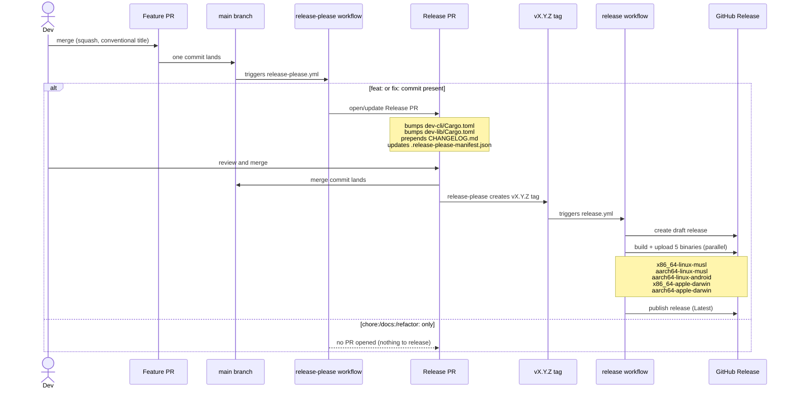
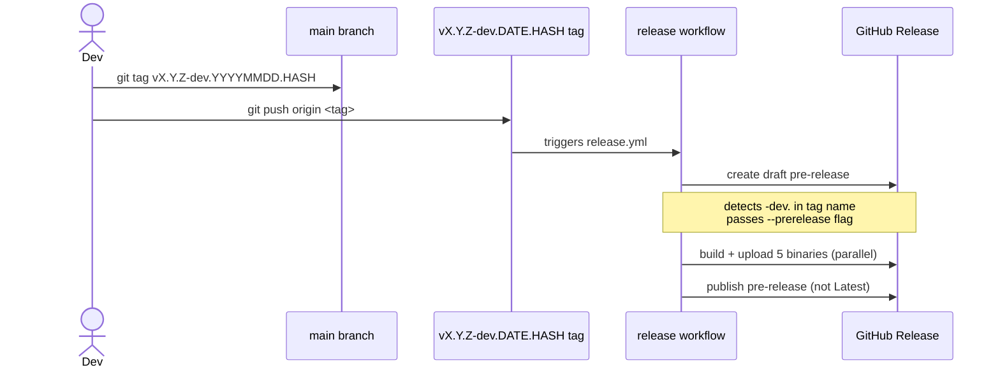

# ADR 001: Release automation with release-please

## Status

Proposed — pending validation that release-please behaviour aligns with project CI/CD goals (see open thread on PR #36)

## Context

The project produces a CLI binary (`dev`) distributed as prebuilt binaries via GitHub Releases. We need:

- Automated version bumping in `Cargo.toml`
- A `CHANGELOG.md` generated from commit history
- A stable release tag that triggers the binary build workflow
- A separate dev channel for pre-release builds

The project uses squash-merge only on `main`, so every merged PR produces exactly one commit. All PR titles must follow Conventional Commits — this is the input release-please uses to determine version bumps and changelog entries.

## Decision

Use **release-please** (`googleapis/release-please-action@v4`) for stable release automation.

### Release PR lifecycle

release-please maintains **one** Release PR at a time — it does not open a new PR per commit to `main`. The behaviour per commit type is:

| Commit type | Effect |
|---|---|
| `feat:` or `fix:` | Opens the Release PR if none exists; otherwise updates the existing one |
| `chore:`, `refactor:`, `docs:`, `test:` | No Release PR created or updated |

The Release PR accumulates all pending `feat:` and `fix:` commits since the last tag. You decide when to merge it. Until then, `main` continues to receive commits and the dev channel picks them up via manual tagging — no stable release is created until you deliberately merge the Release PR.

See the [release-please FAQ](https://github.com/googleapis/release-please#release-please-bot-does-not-create-a-release-pr-why) for root causes when no PR appears.

### Configuration constraints

**release-please's Rust plugin requires explicit `version = "x.y.z"` in `[package]`.** It does not support Cargo workspace version inheritance (`version.workspace = true`). Sub-crates must carry explicit versions.

The package path in `release-please-config.json` and `.release-please-manifest.json` is `"dev-cli"` — the binary crate. `dev-lib/Cargo.toml` is updated on each release via `extra-files` jsonpath `$.package.version`.

### Release channels

| Channel | Tag pattern | GH Release type | Bootstrap default |
|---|---|---|---|
| stable | `vX.Y.Z` | Published (Latest) | yes |
| dev | `vX.Y.Z-dev.YYYYMMDD.HASH` | Pre-release | no (`--channel dev`) |

---

## Stable release flow



## Dev release flow



The dev channel is never picked up by `bootstrap.sh` default installs.

### Bootstrap commands

**Host (pop-mini) — stable, enable systemd daemon:**
```bash
curl -fsSL https://raw.githubusercontent.com/thompsonson/dev/main/scripts/bootstrap.sh | bash -s -- --host
```

**Client (Mac/Termux) — stable channel:**
```bash
curl -fsSL https://raw.githubusercontent.com/thompsonson/dev/main/scripts/bootstrap.sh | DEV_HOST=pop-mini bash
```

**Client (Mac/Termux) — dev channel:**
```bash
curl -fsSL https://raw.githubusercontent.com/thompsonson/dev/main/scripts/bootstrap.sh | DEV_CHANNEL=dev DEV_HOST=pop-mini bash
```

---

## Alternatives considered

**Cargo-release** — automates version bumping and tagging but does not generate changelogs or open PRs. Requires manual invocation; less integrated with GitHub.

**Manual tagging with manual version bumps** — no tooling overhead but relies on discipline. Rejected because the release PR step enforces a review gate before a stable tag is created.

## Consequences

- All PR titles must be valid Conventional Commits — enforced by squash-merge policy.
- `dev-cli/Cargo.toml` and `dev-lib/Cargo.toml` versions are managed by release-please on stable cuts; do not edit them manually.
- `.release-please-manifest.json` records the last released version under key `"dev-cli"`. If it drifts from `dev-cli/Cargo.toml`, reset it manually and commit to `main`.
- Workspace version inheritance (`version.workspace = true`) must not be used — it breaks the release-please Rust plugin.
