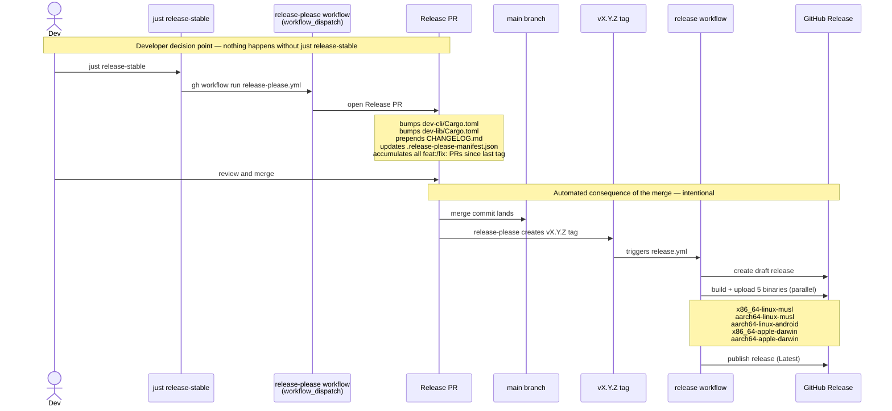
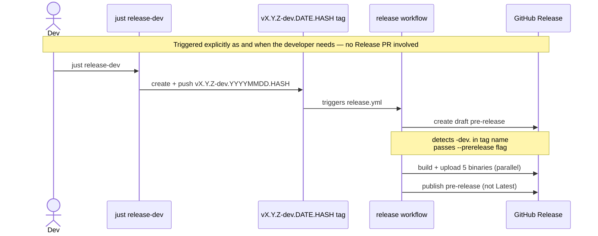

# ADR 001: Release automation with release-please

## Status

Proposed

## Context

The project produces a CLI binary (`dev`) distributed as prebuilt binaries via GitHub Releases. We need:

- Automated version bumping in `Cargo.toml`
- A `CHANGELOG.md` generated from commit history
- A stable release tag, generated by `just release-stable`, that triggers the binary build workflow
- A separate dev channel for pre-release builds

**The CI/CD pipeline must not decide when a stable release happens. That decision belongs to the developer.** Stable releases are a deliberate, explicit act. Dev builds ship from `main`, with less metadata (e.g. no CHANGELOG), as and when the developer needs.

The project uses squash-merge only on `main`, so every merged PR produces exactly one commit. All PR titles must follow Conventional Commits — the input release-please uses to determine version bumps and changelog entries.

Because the repo requires PRs for all commits to `main`, the Release PR is a structural necessity: release-please must bump `Cargo.toml` and `CHANGELOG.md`, and those changes must land via a PR. This is a constraint of the branch protection model, not a process choice.

## Decision

Use **release-please** (`googleapis/release-please-action@v4`) for version management, changelog generation, and stable release execution, triggered **manually** via `just release-stable` rather than automatically on every push to `main`.

### Why manual trigger

release-please's default model triggers on every push to `main`, opening or updating a Release PR whenever a `feat:` or `fix:` PR lands. This ties the stable release cadence to the development cadence and removes the developer's explicit control over when a stable release happens.

Changing the workflow trigger to `workflow_dispatch` only — exposed as `just release-stable` — keeps release-please handling version calculation and changelog generation while preserving the developer as the sole decision-maker for stable releases.

### Release PR lifecycle

Since the repo uses squash-merge only, one merged PR = one commit on `main`. release-please maintains **one** Release PR at a time, accumulating all releasable PRs since the last stable release:

| Merged PR type | Effect |
|---|---|
| `feat:` or `fix:` | Included in the next Release PR when `just release-stable` is run |
| `chore:`, `refactor:`, `docs:`, `test:` | Never included — not releasable units |

A stable release may include many merged PRs. No Release PR is opened automatically — it only appears when `just release-stable` is explicitly run. Until then `main` keeps moving and dev builds are created via `just release-dev`.

### Configuration constraints

**release-please's Rust plugin requires explicit `version = "x.y.z"` in `[package]`.** Cargo workspace version inheritance (`version.workspace = true`) is not supported. Sub-crates must carry explicit versions.

The package path in `release-please-config.json` and `.release-please-manifest.json` is `"dev-cli"`. `dev-lib/Cargo.toml` is updated on each release via `extra-files` jsonpath `$.package.version`.

### Release channels

| Channel | Tag pattern | GH Release type | Bootstrap default |
|---|---|---|---|
| stable | `vX.Y.Z` | Published (Latest) | yes |
| dev | `vX.Y.Z-dev.YYYYMMDD.HASH` | Pre-release | no (`--channel dev`) |

---

## Stable release flow



## Dev release flow



The dev channel is never picked up by `bootstrap.sh` default installs.

### Bootstrap commands

**Host (pop-mini) — stable, enable systemd daemon:**
```bash
curl -fsSL https://raw.githubusercontent.com/thompsonson/dev/main/scripts/bootstrap.sh | bash -s -- --host
```

**Client (Mac/Termux) — stable channel:**
```bash
curl -fsSL https://raw.githubusercontent.com/thompsonson/dev/main/scripts/bootstrap.sh | DEV_HOST=pop-mini bash
```

**Client (Mac/Termux) — dev channel:**
```bash
curl -fsSL https://raw.githubusercontent.com/thompsonson/dev/main/scripts/bootstrap.sh | DEV_CHANNEL=dev DEV_HOST=pop-mini bash
```

---

## Alternatives considered

These alternatives are documented for reference in case release-please proves unworkable.

**Automatic push-to-main trigger** — release-please's default. Opens a Release PR on every `feat:`/`fix:` merge. Incompatible with the principle: the pipeline would decide when a stable release happens.

**`skip-github-pull-request: true`** — suppresses the Release PR; tag and release fire automatically on every releasable commit. Incompatible with the principle: no human decision point.

**Knope** — `workflow_dispatch` releases with no PR. Compatible with the principle but less mature and requires additional tooling.

**Cargo-release** — version bumping and tagging, no changelog generation. Compatible with the principle but no CHANGELOG automation.

**Manual tagging with manual version bumps** — fully explicit but no CHANGELOG and no version consistency enforcement.

## Consequences

- Merging the Release PR is the single required human action for a stable release. Everything after — tag creation, binary builds, GitHub Release publish — is intentional automation as a consequence of that decision.
- `just release-stable` is the only trigger that opens a Release PR. No automation does so without it.
- Dev builds are created via `just release-dev` as and when needed, with no changelog.
- All PR titles must be valid Conventional Commits — enforced by squash-merge policy.
- `dev-cli/Cargo.toml` and `dev-lib/Cargo.toml` versions are managed by release-please on stable cuts; do not edit them manually.
- `.release-please-manifest.json` records the last released version under key `"dev-cli"`. If it drifts, reset it to match `dev-cli/Cargo.toml` and commit to `main`.
- Workspace version inheritance (`version.workspace = true`) must not be used — it breaks the release-please Rust plugin.
