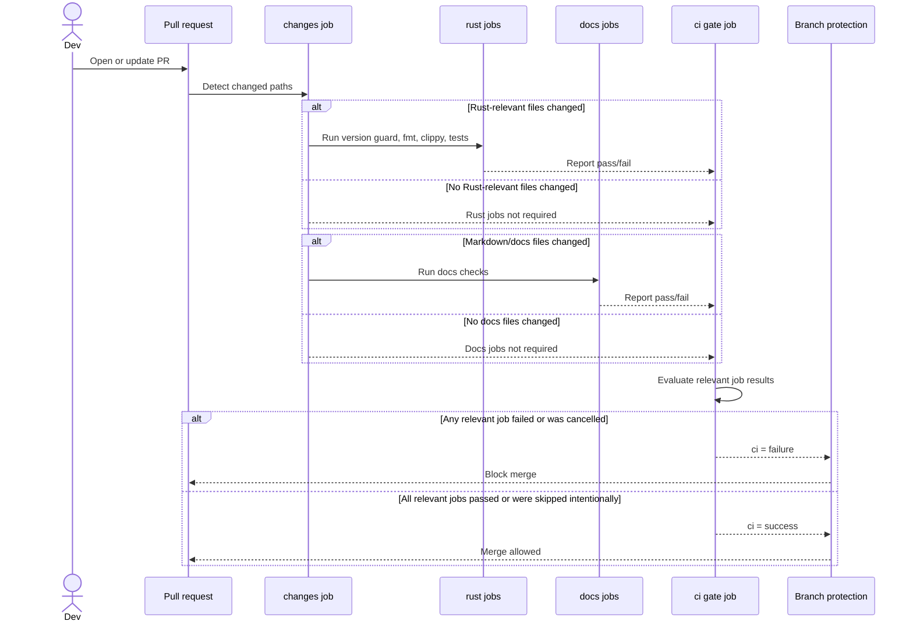

# CI Required Gate Flow

Branch protection should require one always-emitted check named `ci`, not individual conditional jobs.

This keeps branch protection reliable while allowing the workflow to skip irrelevant work for docs-only or config-only PRs.

## Flow

## Decision Points

- Required checks must always be emitted for every protected PR.
- Conditional jobs may be skipped, but skipped jobs must not be directly required by branch protection.
- Branch protection should require only the final `ci` gate check.
- The `ci` gate must fail if any relevant job fails or is cancelled.
- Path detection decides which job groups are relevant for a PR.
- Docs-only PRs should not run Rust tests unless Rust/Cargo/release files changed.

## Relevant File Groups

Rust CI is relevant when these files change:

- `**/*.rs`
- `**/Cargo.toml`
- `**/Cargo.lock`
- `.release-please-manifest.json`

Docs checks are relevant when these files change:

- `**/*.md`
- `docs/**`

## Branch Protection

Require:

- `ci`

Do not require directly:

- `version consistency`
- `test (ubuntu-latest)`
- `test (macos-latest)`

Those checks may remain visible on PRs, but they should be implementation details behind the required gate.
